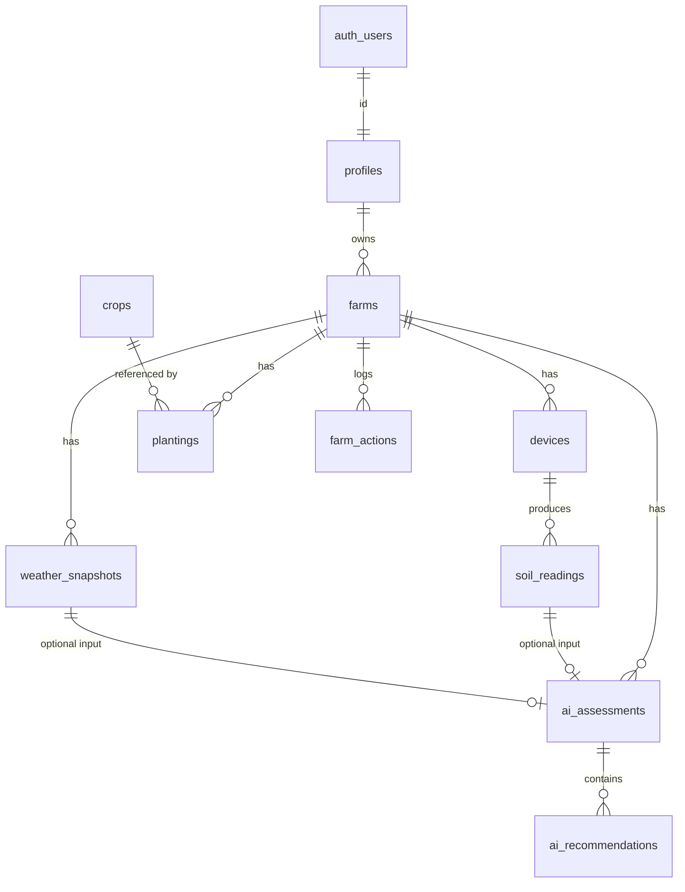
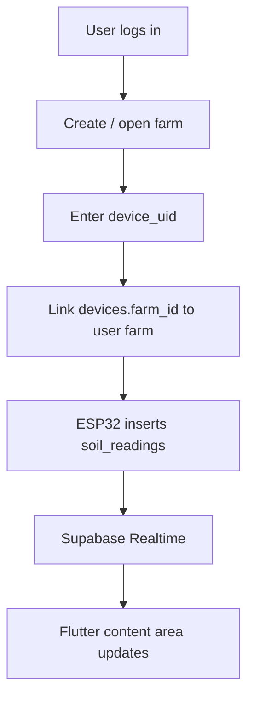

# SoilGood — Data Model

## Scope decisions
- **Auth:** Supabase Auth (login). Data follows the **user account**, not the cellphone.
- **Product scope (v1):** 1 farm + 1 ESP32 per user — enforced in the **app**, not with hard UNIQUE 1:1 constraints.
- **Schema:** Normalized tables with foreign keys only (flexible if we demo a 2nd device later).
- **`crops`:** In-database **reference** data (not fetched from the internet).
- **Password:** Handled only by Supabase Auth — **no** `password` column in `profiles`.
- **Hardware status:** IoT/ESP32 may not exist yet during UI setup. Tables still apply; use **seed / mock readings** for UI development.

## Ownership / access
- User logs in → RLS allows only their own farm-related rows.
- ESP32 is linked via **device claim**: farmer types `device_uid` (QR optional later).
- ESP32 writes to `soil_readings`; Flutter listens via Realtime.

## Entity relationship



## Why each table exists
| Table | Why |
|---|---|
| `profiles` | Farmer name + address fields linked to Auth |
| `farms` | Field/location (lat/long for weather); ownership root for RLS |
| `devices` | ESP32 identity + claim (`device_uid`) |
| `soil_readings` | Timestamped sensor history (~15 min) |
| `weather_snapshots` | Weather aligned with farm/history for advice + analytics |
| `crops` | Ideal soil ranges for suitability checks |
| `plantings` | What is currently planted on the farm |
| `ai_assessments` | Stored AI overview / soil health score |
| `ai_recommendations` | Structured actions (irrigation, nutrient, etc.) |
| `farm_actions` | What the farmer actually did (needed for analytics) |

## Tables & fields

### `profiles`
- `id` (PK, = `auth.users.id`)
- `first_name`, `last_name`
- `barangay`, `municipality_city`, `province`
- `created_at`, `updated_at`

### `farms`
- `id`, `owner_id` → `profiles.id`
- `name`
- `barangay`, `municipality_city`, `province`
- `latitude`, `longitude`
- `created_at`

### `devices`
- `id`, `farm_id` → `farms.id`
- `device_uid` (**unique** claim string)
- `name`, `status`, `last_seen_at`
- `created_at`

### `soil_readings`
- `id`, `device_id` → `devices.id`
- `recorded_at`
- `moisture_percent`, `ph`, `soil_temperature_c`, `ec`
- `nitrogen`, `phosphorus`, `potassium`
- `validation_status`, `validation_message`

### `weather_snapshots`
- `id`, `farm_id` → `farms.id`
- `recorded_at`
- `temperature_c`, `humidity_percent`, `rainfall_mm`
- `rain_probability`, `wind_speed`, `weather_condition`, `source`

### `crops` (reference)
- `id`, `name`
- ideal min/max: moisture, pH, temperature, EC, N, P, K
- `growing_season`, `notes`

### `plantings`
- `id`, `farm_id`, `crop_id`
- `planted_at`, `expected_harvest_at`, `status`

### `ai_assessments`
- `id`, `farm_id`
- `soil_reading_id`, `weather_snapshot_id` (nullable)
- `overview`, `soil_health_score`
- `generated_at`, `model_name`, `prompt_version`

### `ai_recommendations`
- `id`, `assessment_id`
- `type` — `irrigation` \| `nutrient` \| `soil_management` \| `crop_suitability`
- `title`, `description`, `priority`, `recommended_action`
- `valid_until`, `created_at`

### `farm_actions`
- `id`, `farm_id`, `created_by`
- `action_type` — `irrigation` \| `fertilizer` \| `planting` \| `treatment`
- `amount`, `unit`, `notes`, `performed_at`

## Device claim flow



## ESP32 → cloud → app

```text
ESP32 sensors (~15 min)
  → HTTPS write (prefer Edge Function + validation later)
  → soil_readings
  → Realtime
  → Flutter listener + cache/skeleton UI
```

Without hardware yet: insert **mock rows** into `soil_readings` (SQL or Table Editor) to build UI.

## What we store vs compute
- **Store:** readings, weather snapshots, crops, AI results, farm actions
- **Compute later (analytics):** trends, correlations, predictions via SQL on history — no extra “magic” tables required for v1

## Out of scope for v1
- Multi-farm / multi-device UI
- QR claim (text `device_uid` first)
- Paid APIs

## SQL source of truth
1. Run: [`supabase_schema.sql`](supabase_schema.sql) in the Supabase SQL Editor.
2. If project was created with **Automatically expose new tables = OFF**, also run [`supabase_grants.sql`](supabase_grants.sql) (also appended to the schema file for new installs).

### Verification notes (2026-07-25)
- Auth signup works with the **legacy anon JWT** (`eyJ...`).
- New `sb_publishable_...` key authenticated Auth health but REST returned 401 in our tests — use **legacy anon key** for Flutter for now.
- Without GRANTs, logged-in insert failed: `permission denied for table farms` (hint: GRANT to `authenticated`). RLS was not the blocker.

## Open decisions
- Exact crop list / ideal ranges (DA, PhilRice, etc.)
- ESP32 write path: Edge Function vs constrained insert
- Weather write timing: with each reading vs scheduled
