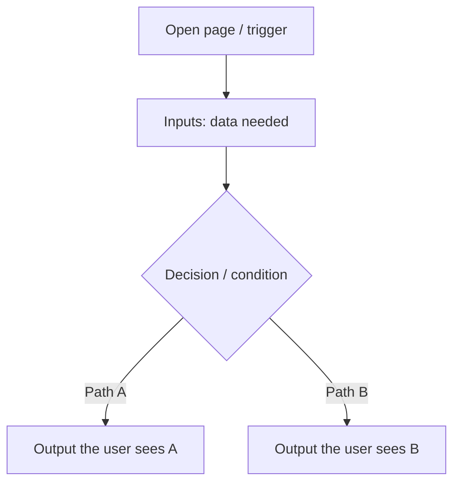

# Page: \<Page Name\>

> Copy this file to `docs/pages/<page-name>.md` and fill every section.  
> Goal: anyone (including future you) can reopen this and know what the page does, how it works, and what it outputs.

## Status
- [ ] Planned
- [ ] In progress
- [ ] Done

## Purpose / goal
One or two sentences: what problem this page solves for the farmer.

## User flow
- What the farmer sees
- Primary actions (taps, filters, buttons)
- Pull-to-refresh if this page shows system data (required — see `.cursor/rules/page-architecture/pull-to-refresh.mdc`)

## Data & sources
- Where data comes from (sensors, weather API, Supabase, local cache, etc.)
- What is cached
- What is realtime / streamed

## UI states
| State | What the user sees |
|---|---|
| Skeleton | Structure of the page while loading |
| Cached | Last known data immediately |
| Live | Updated from stream / fetch |
| Refreshing | Pull-to-refresh; keep last-known data; refetch all sources |
| Empty | Clear empty message |
| Error | Visible failure (no silent fallback) |

## Optimistic UI
| Action | Optimistic change | On failure |
|---|---|---|
| … | … | Rollback + visible error |

Default: actions that should normally succeed use optimistic UI.

## Functions
| Function | What it does | When called |
|---|---|---|
| `exampleFn()` | … | … |

## Page logic flowchart
**Main flowchart = how this page works:** inputs → decisions → **outputs the farmer sees** (not only the generic loading pipeline).

Optional second small flowchart for load pipeline: cache → skeleton → stream → optimistic action → success/fail.

## Related
- Shared widgets used
- Other pages connected
- Open decisions / notes
