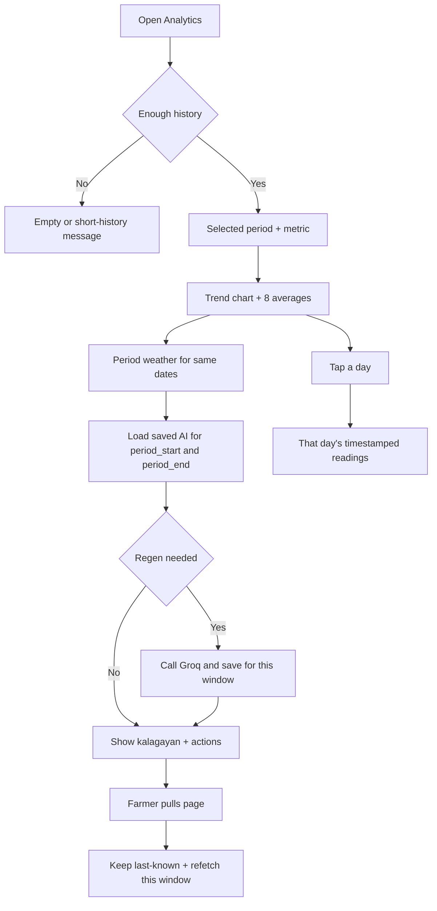

# Page: Analytics

## Status
- [ ] Planned
- [x] In progress (range filters + Groq period AI keyed to start/end; re-run `supabase_analytics.sql`)
- [ ] Done

## Purpose / goal
**Over time.** Answer: what has this field been doing, and what should I plan next?

Farm notebook: **history** (past readings), **trends**, **period averages**, and **Groq period AI** (kalagayan of the **selected** window + soil/crop actions). Not a second Home. Latest 8-in-1, current weather, and “water tomorrow morning” belong on [Home](home.md).

## User flow
- Open Analytics tab from app shell.
- Pick **Period** (dropdown): This week (default, ISO Mon–today), Last week, Last 2 weeks, Last 30 days, or **Pick a week / Pick a month** (calendar).
- Pick **Metric**: **All sensors** (default, overlay chart) or one of moisture / pH / temp / EC / salinity / N / P / K.
- Read the **trend chart** for that window (daily buckets). **All sensors** shows 8 avg/min/max boxes for the selected dates; a single metric shows one avg + min/max. Tap a box to open that metric’s real-unit chart.
- Read **period weather** for the same dates (total rain, rainy days, avg high/low) — not Home’s live forecast.
- Tap a day on the chart → **that day’s readings** (pushed page, slide from right).
- Read Groq **kalagayan** + action cards for **that same date window** (loaded from `ai_assessments` for `period_start` + `period_end`).
- **Pull-to-refresh** the page (vertical).

## In / out (locked)

**On Analytics**
- History: aggregated series + tap-a-day reading list.
- Period averages / min / max for all 8 sensors (All sensors) or one metric.
- Period weather for the same window (Open-Meteo daily range).
- Groq period AI: overview of the selected window + `soil_management` / `nutrient` / `crop_suitability` / pattern irrigation.
- Short-history banner when fewer days than the selected range.

**Not on Analytics**
- Live-looking 8-in-1 grid of current values.
- Current weather 2×2 / live 3-day forecast (Home).
- Duplicate Home AI (“irrigate tomorrow 6:00 AM”).
- A separate History bottom-nav tab.

## Data & sources
- **History / trends:** RPC `analytics_soil_daily` with `p_from` / `p_to` for the selected Manila dates. SQL: [`../context/supabase_analytics.sql`](../context/supabase_analytics.sql).
- **Period stats:** avg / min / max from those buckets (client) for each sensor in the selected window.
- **Period weather:** Open-Meteo daily range for the same Manila dates (forecast API if start is within ~90 days, else archive). Not `weather_snapshots` yet.
- **Day list:** `soil_readings` for that Manila day.
- **Period AI:** load latest `ai_assessments` where `kind = analytics` and **`period_start` + `period_end` match** the selected range. Call Edge Function `soilgood-insights` (`job=analytics`) only if none saved for that window, `valid_until` passed, prompt version changed, or a newer bucket day exists. Empty history → no Groq call. Save overview + `ai_recommendations` with the same start/end. Rules/bands: [`insights.json`](../../supabase/functions/soilgood-insights/insights.json) (`prompts.analytics`) — [AI_INSIGHTS.md](../context/AI_INSIGHTS.md).
- **Weather vs soil:** period weather is fetched live for the window and sent to Groq. `weather_snapshots` persist is still later.
- First open: skeleton. Pull: keep last-known soil/weather/AI. No `watchLatest`. Partial failure: soil can succeed while weather shows its own error.

## UI states
| State | What the farmer sees |
|---|---|
| Skeleton | First open only — chart + AI placeholders |
| Cached | Last-known series + last AI for this window during pull |
| Live | After fetch (no live “now” sensor grid) |
| Refreshing | Page-level `RefreshIndicator`; ~15s history timeout; Groq ~20s |
| Empty / short history | No rows, or fewer days than the range — visible message; no invented average |
| Error | Per-source (history vs AI). Chart can succeed while AI fails |

## Optimistic UI
None (read-only).

## Functions
| Function | What it does | When called |
|---|---|---|
| `_reloadAll()` | Soil + period weather in parallel, then AI; skip AI if history failed | First visible, pull, period change |
| `_loadHistory()` | Timed `fetchDaily(start, end)` RPC | `_reloadAll` |
| `_loadWeather()` | Timed Open-Meteo daily range for the same dates | `_reloadAll` |
| `_loadAi()` | Load saved AI for this start/end; Groq + save if regen | After successful history |
| `shouldRegenPeriodAi()` | Same start/end + same last bucket → no Groq | Before Groq |
| `_openDay()` | Push `DayReadingsPage` | Tap chart |

## Page logic flowchart

## Related
- Shell: Home / Analytics / Crops / Profile. **Now** view: [home.md](home.md).
- Groq setup: [BACKEND.md](../context/BACKEND.md) / [AI_INSIGHTS.md](../context/AI_INSIGHTS.md). Key is an Edge Function secret, not `.env`.
- Rules: `.cursor/rules/page-architecture/responsive-ui.mdc`, `pull-to-refresh.mdc`, `scrollbar.mdc`.
