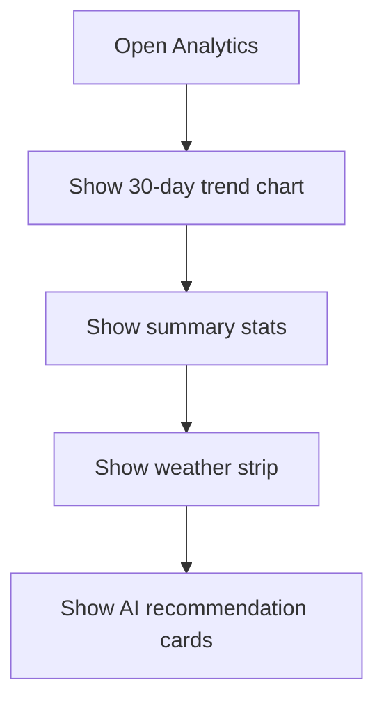

# Page: Analytics

## Status
- [x] In progress (UI / navigation only)

## Purpose / goal
Show soil trends over time and actionable AI guidance (irrigation, weather, nutrients).

## Data
Mock chart + sample stats for now. Later: SQL aggregations on `soil_readings` + weather snapshots.

## Flowchart

