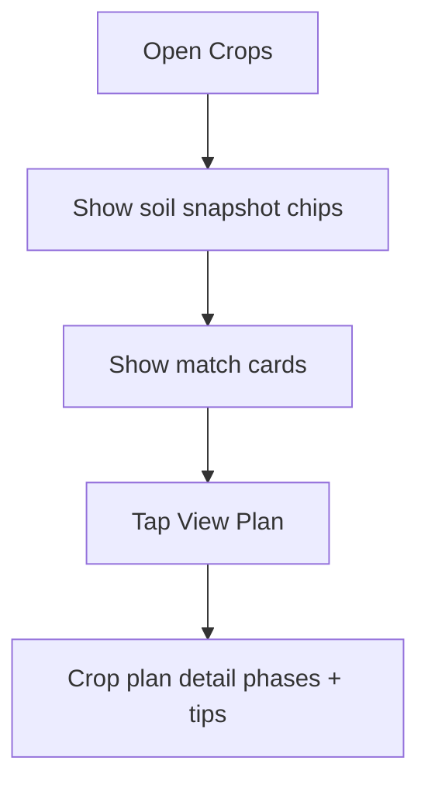

# Page: Crops

## Status
- [x] In progress (UI / navigation only)

## Purpose / goal
Show crop suitability matches from soil conditions and open a cultivation plan detail.

## Navigation
- Crops list → **View Plan** → `CropPlanPage` (push route).

## Data
Mock match scores and reasons. Later: compare readings vs `crops` reference table + plantings.

## Flowchart

