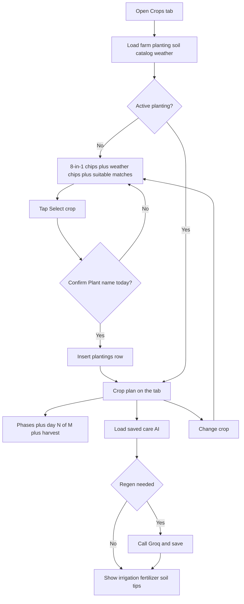

# Page: Crops

## Status
- [ ] Planned
- [x] In progress (live catalog match + planting plan + Groq care)
- [ ] Done

## Purpose / goal
Help the farmer pick a crop that fits the **latest** soil snapshot, then follow a cultivation plan (phase, days to harvest, Groq care tips).

Not a history page. Monthly / seasonal fit from past readings belongs on [Analytics](analytics.md).

## User flow
- Open Crops tab from the app shell.
- **No selected crop:** all **8-in-1** soil chips + this week’s weather chips + ranked **suitable** catalog matches (soil + forecast). Tap **Select crop** → confirm **Plant {name} today?** → plant it (today).
- **Has selected crop:** the list is gone. The tab shows the **crop plan**: current phase, day N of M, harvest date, Groq irrigation / fertilizer / soil care.
- **Change crop** (confirm) sets the planting to `replaced` and returns to the list.
- **Pull-to-refresh** the page (vertical). Phase strip stays horizontal-only.

## In / out (locked)

**On Crops**
- Latest **8-in-1** soil chips (moisture, pH, temperature, EC, salinity, N, P, K) — chips, not Home’s live grid.
- This week’s Open-Meteo chips (air temp, rain chance, condition) for matching.
- Catalog match from the **latest** reading vs `crops` min/max **plus** forecast (PH wet/dry season, rain, air temp) — **local**, no Groq.
- One active `plantings` row per farm (v1) — enforced by partial unique index `plantings_one_active_per_farm_uidx` (see [`supabase_plantings_one_active.sql`](../context/supabase_plantings_one_active.sql)).
- Timeline from `planted_at` + catalog `phases` / `days_to_maturity` — **local**.
- Groq **care** insights only when a crop is selected (dilig / abono / soil for this crop and phase).

**Not on Crops**
- Home’s “water today” one-liner.
- Analytics kalagayan of the selected date window, or **historical** seasonal fit from past months.
- Groq for catalog scores.

## Data & sources
- **Soil chips:** `SoilReadingsRepository.fetchLatest` (same latest row as Home; no month load). All eight probe fields.
- **Weather chips + match:** live Open-Meteo at the farm pin (same service as Home). Fetched on first load and pull, even before a crop is selected. Fail visibly; soil match still runs.
- **Catalog:** `public.crops` (8-in-1 ranges + `growing_season` + `scientific_name` + `days_to_maturity` + `phases` jsonb). SQL: [`../context/supabase_crops_home_ai.sql`](../context/supabase_crops_home_ai.sql).
- **Selected crop:** `public.plantings` (`status = active`). Select = confirm then insert (`planted_at` = Manila today). Change = confirm then set `replaced`. DB allows at most one active per farm.
- **Care AI:** load latest `ai_assessments` where `kind = 'crops'` and `planting_id` matches. Call Edge Function `soilgood-insights` (`job=crops.care`) only if none saved, soil reading changed, `valid_until` passed, phase changed, or prompt version changed. No reading → no Groq call. Save overview + `ai_recommendations`. Rules: [`insights.json`](../../supabase/functions/soilgood-insights/insights.json) (`prompts.crops.care`).
- First open: skeleton. Pull: keep last-known. Groq waits until the tab is visible (`TickerMode`) so IndexedStack does not bill on every app open.
- No Realtime on this tab (pull + first load).

## UI states
| State | What the user sees |
|---|---|
| Skeleton | First open only — chips + cards placeholders |
| Cached | Last-known list or plan during pull |
| Live | After fetch |
| Refreshing | Page-level `RefreshIndicator`; ~15s data timeout; Groq ~20s |
| Empty | No reading, no catalog, or no crop ≥ ~50% match — visible message |
| Error | Per-source (soil / catalog / planting / AI). Plan can show while AI fails |

## Optimistic UI
| Action | Optimistic change | On failure |
|---|---|---|
| Select crop | Confirm → show plan immediately | Rollback to list + visible error |
| Change crop | Confirm → return to list | Restore plan + visible error |

## Functions
| Function | What it does | When called |
|---|---|---|
| `_reloadAll()` | Farm, planting, soil, catalog, weather; then care AI if planted | `TickerMode` first visible, pull |
| `_selectCrop()` | Confirm, then insert active planting | Tap Select crop → confirm |
| `_changeCrop()` | Confirm, then mark planting `replaced` | Confirm Change crop |
| `scoreCropMatches()` | % of 8-in-1 ranges + weather checks that fit | After soil + catalog + weather load |
| `timelineFor()` | Day N / current phase / harvest date | When a planting exists |
| `_loadCareAi()` | Load saved crops AI; Groq + save if regen | After successful plan load |

## Page logic flowchart

## Related
- Shell: Home / Analytics / Crops / Profile.
- Groq setup: [BACKEND.md](../context/BACKEND.md) / [AI_INSIGHTS.md](../context/AI_INSIGHTS.md). Key is an Edge Function secret, not `.env`.
- Rules: `.cursor/rules/page-architecture/responsive-ui.mdc`, `pull-to-refresh.mdc`.
