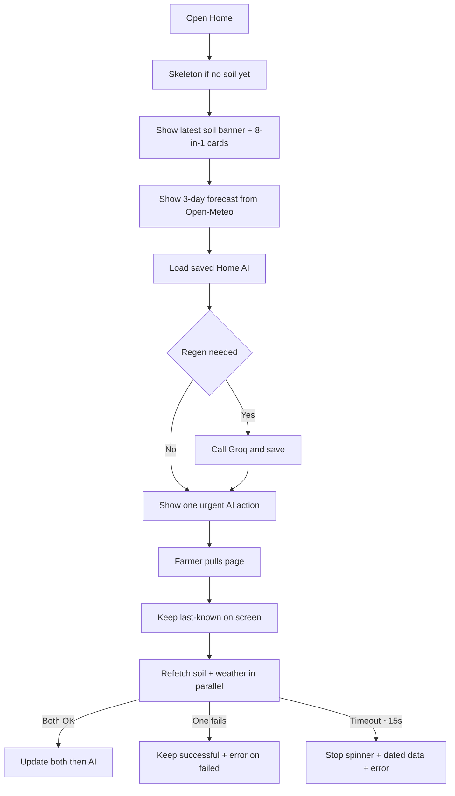

# Page: Home Dashboard

## Status
- [ ] Planned
- [x] In progress (live soil + weather + Groq today tip)
- [ ] Done

## Purpose / goal
**Now.** Answer: should I water, wait, or check the sensor *today*?

Show the latest soil condition, live 8-in-1 values, a short forecast, and **one** urgent AI action. This is not a history or monthly-average page — that is [Analytics](analytics.md).

## User flow
- Open Home tab from app shell.
- Scan overall condition → compact 8-in-1 sensor cards → 3-day forecast → one AI action.
- **Pull-to-refresh** the page (vertical) to refetch soil + weather. Forecast strip stays horizontal-only.
- Optional later: tiny last-24h moisture sparkline under the condition banner, with “See trends” → Analytics. Not a month chart.

## In / out (locked)

**On Home**
- Latest reading only (timestamp + stale/error must be visible).
- Live 8-in-1 grid (the only place current sensor values are shown).
- Short forecast (today–3 days) for irrigation *today*.
- One urgent AI tip tied to the latest soil + weather (water / wait / fix sensor).

**Not on Home**
- Monthly / 7-day averages, multi-metric trend charts, nutrient-depletion stories.
- Browseable history (day list of past readings).
- Weather–soil correlation or seasonal crop fit from history.

## Data & sources
- **Soil cards (2×4 compact grid; 1 column if width < 360):** latest row from `soil_readings` (fetch + Realtime stream) via `SoilReadingsRepository` (`fetchLatest` / `watchLatest` only — do not load a month here).
  Moisture, temperature, pH, EC, salinity (ppt), nitrogen, phosphorus, potassium.
- **Forecast:** live from **Open-Meteo** using farm lat/long (fail visibly if no farm / network error).
- **Saved AI:** latest `ai_assessments` where `kind = 'home'`. Call Edge Function `soilgood-insights` (`job=home`) only if none saved, `soil_reading_id` changed, or `valid_until` passed (~12h). No reading → no Groq call. Pull always loads saved first. Realtime may update sensor cards; AI stays until pull/reopen. `weather_snapshot_id` stays null this round (live Open-Meteo facts go in the prompt only). Rules/bands: [`insights.json`](../../supabase/functions/soilgood-insights/insights.json). See [AI_INSIGHTS.md](../context/AI_INSIGHTS.md). SQL kind column: [`../context/supabase_crops_home_ai.sql`](../context/supabase_crops_home_ai.sql).
- Enable Realtime: run [`../context/supabase_realtime.sql`](../context/supabase_realtime.sql) if inserts do not appear live.

## UI states
| State | Notes |
|---|---|
| Skeleton | First open only — banner + sensor placeholders until first soil fetch |
| Cached / live | Last-known soil + weather stay on screen during pull |
| Refreshing | Page-level `RefreshIndicator`; refetch soil + weather in parallel (~15s); Groq ~20s if regen |
| Empty | No readings yet — message to link a device |
| Error | Per-source banners (soil and/or weather). Successful source is kept; page is not rolled back |

## Optimistic UI
None (read-only).

## Functions
| Function | What it does | When called |
|---|---|---|
| `_warmCache()` | Timed `fetchLatest` for first paint | `initState` |
| `watchLatest()` | Realtime stream | Whole page |
| `_loadWeather()` | First Open-Meteo load (section spinner if no weather yet) | `initState` |
| `_reloadAll()` | Parallel soil + weather refetch; then cheap-load saved Home AI (Groq only if regen) | Pull-to-refresh |
| `_loadHomeAi()` | Load saved `kind=home`; Groq + save if regen | After soil (and weather attempt) on first load + pull |

## Page logic flowchart

## Related
- Shell: Home / Analytics / Crops / Profile. Over-time view: [analytics.md](analytics.md).
- Crops uses the **latest** snapshot plus current forecast for catalog match — not Home’s job to show monthly averages.
- Rules: `.cursor/rules/page-architecture/responsive-ui.mdc`, `pull-to-refresh.mdc`.
