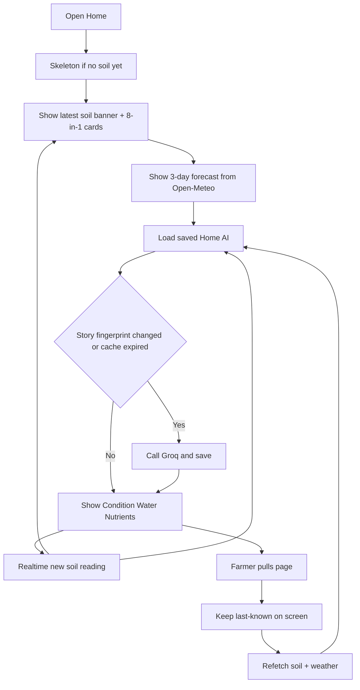

# Page: Home Dashboard

## Status
- [ ] Planned
- [x] In progress (live soil + weather + three Groq tips)
- [ ] Done

## Purpose / goal
**Now.** Answer today: what is the soil condition, should I water, and (if a crop is set) what about fertilizer?

Show the latest soil condition, live 8-in-1 values, a short forecast, and **three** AI cards: Condition, Water today, Nutrients. This is not a history or monthly-average page — that is [Analytics](analytics.md).

## User flow
- Open Home tab from app shell.
- Scan overall condition → compact 8-in-1 sensor cards → 3-day forecast → three AI tips.
- **Realtime:** a new `soil_readings` row updates sensor cards and **rechecks** Home AI (usually reuse saved tips; Groq only if story fingerprint / cache says so). No pull required for tip updates while Home is open.
- **Pull-to-refresh** still refetches soil + weather + AI path (weather is not Realtime). Forecast strip stays horizontal-only.
- Nutrients CTA (no crop): open Crops tab to add a planting.
- **Closed app:** no AI — generation only while Home is mounted.

## In / out (locked)

**On Home**
- Latest reading only (timestamp + stale/error must be visible).
- Live 8-in-1 grid (the only place current sensor values are shown).
- Short forecast (today–3 days) for watering *today*.
- Three AI cards tied to latest soil + weather (+ active crop when set):
  1. **Condition** (`soil_management`) — alert or “soil looks fine”
  2. **Water today** (`irrigation`) — water / wait / check sensor
  3. **Nutrients** (`nutrient`) — crop-aware fertilizer tip, or CTA if no planting

**Not on Home**
- Monthly / 7-day averages, multi-metric trend charts, nutrient-depletion stories.
- Browseable history (day list of past readings).
- Weather–soil correlation or seasonal crop fit from history.
- Overview essay above the three cards (Condition carries status).

## AI voice (locked)
Caring neighbor farmer, **simple English**. Warm, calm, 2–4 short sentences with a why + next step. No deep vocabulary, no chatbot tone, no em dash habit. Mention **sensor only when the reading looks wrong**. Never refer the farmer to a farm officer / DA / extension. Rules live in [`insights.json`](../../supabase/functions/soilgood-insights/insights.json) `voice` + `prompts.home`. See [AI_INSIGHTS.md](../context/AI_INSIGHTS.md).

## Data & sources
- **Soil cards (2×4 compact grid; 1 column if width < 360):** latest row from `soil_readings` (fetch + Realtime stream) via `SoilReadingsRepository`.
- **Forecast:** live **Open-Meteo** using farm lat/long (fail visibly if no farm / network error).
- **Active crop:** `CropsRepository.fetchActivePlanting` for Nutrients + Groq crop/phase facts.
- **Saved AI:** latest `ai_assessments` where `kind = 'home'`. Story fingerprint (bands including temp + rain advice + crop/phase + crop range token) is stored on the overview line (`SGFP:…`) so smarter regen can skip Groq when the farmer story is unchanged. Classified bands use the active crop’s catalog ranges when planted; otherwise universal floors. Critical bands → urgent tip voice + high priority. Call Edge Function `soilgood-insights` (`job=home`) only if none saved, fingerprint changed, `valid_until` passed (~12h), or `prompt_version` changed. No reading → no Groq. Triggers while Home is open: first load, pull, and **Realtime new reading id**. Closed app does not call Groq. Rules/bands: [`insights.json`](../../supabase/functions/soilgood-insights/insights.json). Crop research: [`CROP_RANGES.md`](../context/CROP_RANGES.md).

## UI states
| State | Notes |
|---|---|
| Skeleton | First open only — banner + sensor + three AI placeholders until first soil fetch |
| Cached / live | Last-known soil + weather + AI stay on screen during pull and during Realtime AI recheck |
| Refreshing | Page-level `RefreshIndicator`; refetch soil + weather (~15s); Groq ~20s if regen. Realtime AI recheck keeps last tips visible (`loading` only when no assessment yet) |
| Empty | No readings yet — message to link a device |
| Error | Per-source banners (soil and/or weather and/or AI). Successful source is kept |

## Optimistic UI
None (read-only).

## Functions
| Function | What it does | When called |
|---|---|---|
| `_warmCache()` | Timed `fetchLatest` for first paint | `initState` |
| `_onSoilStreamEvent()` | Sync Realtime soil into state; AI recheck if reading id is new | Whole page (subscription) |
| `_loadWeather()` | First Open-Meteo load | `initState` |
| `_reloadAll()` | Parallel soil + weather; then Home AI cheap-load / smarter regen | Pull-to-refresh |
| `_loadHomeAi()` | Coalesced load saved `kind=home`; Groq + save if fingerprint says regen | First load, pull, Realtime new reading id |

## Page logic flowchart

## Related
- Shell: Home / Analytics / Crops / Profile. Over-time view: [analytics.md](analytics.md).
- Rules: `.cursor/rules/page-architecture/responsive-ui.mdc`, `pull-to-refresh.mdc`.
