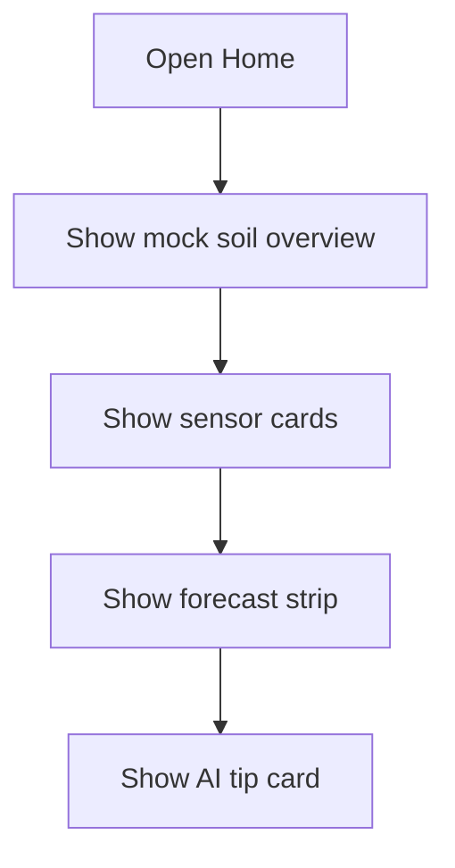

# Page: Home Dashboard

## Status
- [ ] Planned
- [x] In progress (UI / navigation only)
- [ ] Done

## Purpose / goal
Give the farmer an at-a-glance view of soil condition, key sensors, short weather forecast, and a top AI tip.

## User flow
- Open Home tab from app shell.
- Scan overall condition → sensor cards → forecast → AI recommendation card.

## Data & sources
- **Soil cards:** live from `soil_readings` (fetch + Realtime stream) via `SoilReadingsRepository`.
- **Forecast:** live from **Open-Meteo** using farm lat/long (fail visibly if no farm / network error).
- Enable Realtime: run [`../context/supabase_realtime.sql`](../context/supabase_realtime.sql) if inserts do not appear live.

## UI states
| State | Notes |
|---|---|
| Skeleton | Not wired yet (mock UI) |
| Live | Later via Supabase stream |
| Error | Later — fail visibly |

## Optimistic UI
None yet (read-only mock).

## Functions
| Function | Status |
|---|---|
| Live sensor load | Not yet |
| Weather fetch | Not yet |
| AI recommendation load | Not yet |

## Page logic flowchart

## Related
- Shell: Home / Analytics / Crops / Profile bottom nav.
- Design reference: dashboard HTML mockup (tweaked for SoilGood).
