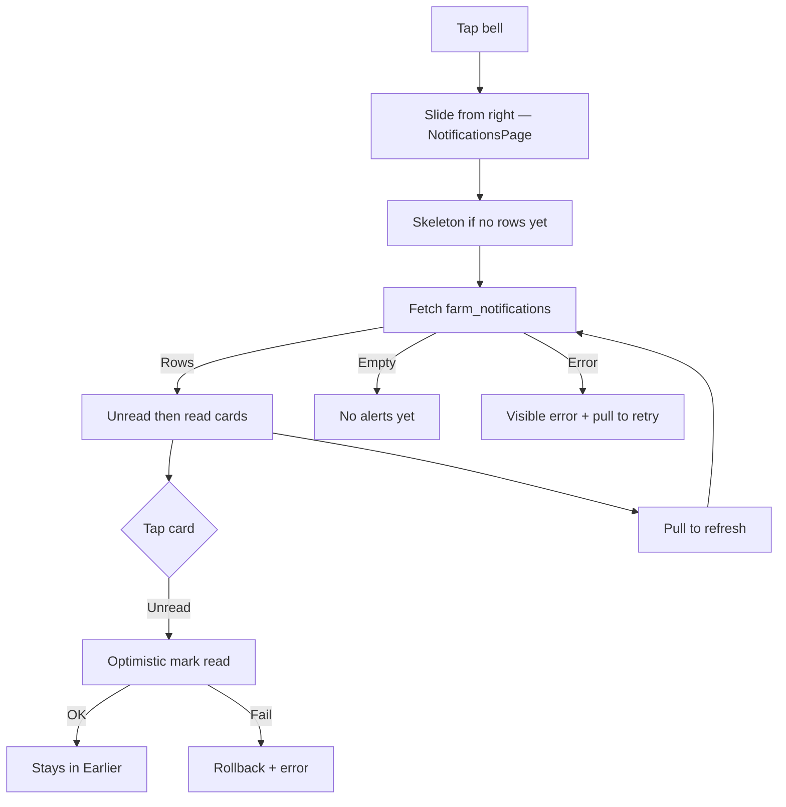
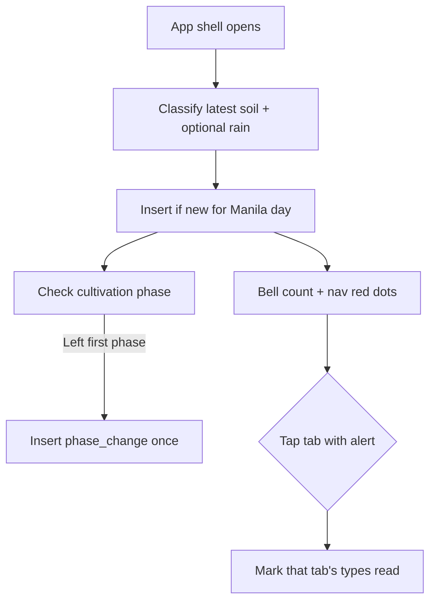

# Page: Notifications

## Status
- [x] Planned
- [x] In progress (engine + inbox)
- [ ] Done

## Purpose / goal
Tell the farmer when the field needs attention **today** (dry soil, sensor down, nutrients, rain) without waiting for them to open Home. Classify → save rows → show them in a pushed inbox from the top-bar bell.

## User flow
- While the shell is open, new ESP32 readings and cultivation **phase changes** are classified. Alert rows are stored in `farm_notifications`.
- Top-bar **bell** shows a **red badge with unread count** (caps at 9+). Tap → inbox slides from right.
- Bottom nav: **red dot** on Home (soil / irrigation / sensor) or Crops (nutrients / phase) when that tab has unread alerts. Dot is hidden on the selected tab.
- **Tap a tab** → those related alerts are marked read (optimistic). Bell count drops.
- Inbox: unread first, tap a card to mark read, **Mark all read**, pull-to-refresh.

## Data & sources
- **Soil:** latest `soil_readings` via `SoilReadingsRepository.watchLatest` / `fetchLatest` (engine).
- **Bands:** local [`insights.json`](../../supabase/functions/soilgood-insights/insights.json) through `InsightsConfig` (0 Groq tokens).
- **Weather:** Open-Meteo rain probability for *today*. Weather fetch failure does not block soil alerts.
- **Inbox:** `farm_notifications` via `NotificationsRepository.fetchRecent` / `watchRecent` / `markRead`. SQL: [`../context/supabase_notifications.sql`](../context/supabase_notifications.sql).
- **Dedup:** unique `(farm_id, dedupe_key)`. Soil types: `{type}:{yyyy-mm-dd}` Manila. Phase: `phase_change:{planting_id}:{phase_id}` (once per phase, not per day).
- **Not used:** Groq.

## UI states
| State | What the user sees |
|---|---|
| Skeleton | Three muted cards on first open only |
| Cached | Last-known alerts stay on screen during pull |
| Live | Realtime inserts appear; pull refetches the table |
| Refreshing | Page-level `RefreshIndicator`; keep last-known; ~15s timeout |
| Empty | “No alerts yet…” |
| Error | Visible error card; successful source kept (pull does not blank) |

## Optimistic UI
| Action | Optimistic change | On failure |
|---|---|---|
| Tap card | Card moves to “Earlier” immediately | Rollback + visible error |
| Mark all read | All unread become read immediately | Rollback + visible error |
| Tap Home / Crops tab | Related unread alerts marked read; bell + nav dots update | Rollback counts; `debugPrint` (no snack on the nav) |

## Functions
| Function | What it does | When called |
|---|---|---|
| `NotificationController.start()` | Load bands, fetch latest reading, listen to Realtime | App shell `initState` |
| `NotificationEvaluator.evaluate()` | Map classified facts → drafts (no I/O) | Each new `soil_reading` id |
| `insertIfNew()` | Insert; ignore same-day duplicate | After evaluate |
| `fetchRecent()` | Load inbox rows | First open + pull |
| `watchRecent()` | Realtime inbox stream | Whole inbox session |
| `markRead()` / `markAllRead()` | Set `read_at` | Tap card / Mark all read |
| Bell `onPressed` | `Navigator.push(AppPageRoutes.slideFromRight(NotificationsPage()))` | Top bar on shell tabs |
| `markTabRead(index)` | Marks types mapped to that shell tab | Bottom-nav tap |
| `_maybeNotifyPhase()` | Inserts `phase_change` when timeline leaves phase 0 | Shell start + each new soil reading |

## Page logic flowchart

Engine (shell, while inbox may be closed):

## Related
- Bell: `SoilGoodTopBar` in `lib/features/shell/app_shell.dart`.
- Page: `lib/features/notifications/presentation/notifications_page.dart`.
- Shared: `AppRefreshScroll`, `SoftCard`, `SectionHeader`, `StatusChip`.
- Open decisions: OS / FCM when the app is killed.
- Tab map: Home ← irrigation, soil_alert, sensor_error, device_offline. Crops ← nutrient_low, phase_change. Analytics / Profile have no dots yet.
- Re-run [`../context/supabase_notifications.sql`](../context/supabase_notifications.sql) to allow `phase_change`.
