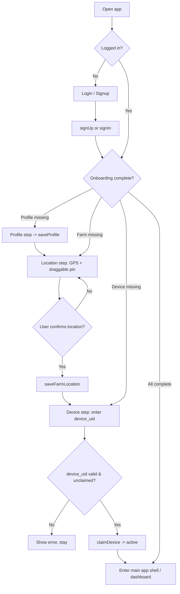

# Page: Signup & Onboarding

> Covers account signup + first-run onboarding (profile, farm location, device claim).

## Status
- [ ] Planned
- [x] In progress
- [ ] Done

### Implemented
- Login + signup UI + Supabase auth
- Session-aware `AuthGate` routed by onboarding status
- **Step 1 Profile** — saves to `profiles`
- **Step 2 Farm location** — GPS + map pin (tap to move), **Carto Voyager** tiles, saves to `farms`
- **Step 3 Device claim** — `device_uid` → `devices` (skippable)
- App shell with Home / Analytics / Crops / Profile
- **Live soil readings** on Home via Supabase stream (empty state if none)

### Still pending
- Remember Me / Forgot password (deferred)
- Live weather API
- AI module wired to live readings
- QR device claim
- Reverse-geocoding address from pin (optional)

## Purpose / goal
Get a new farmer from zero to a ready account: create login, capture name, set the farm location (for weather), and link their ESP32 — without overwhelming them in one giant form.

## Flow overview (split into steps)
1. **Signup** — email + password + confirm-password UI validation.
2. **Onboarding** (separate screens after first login):
   1. Profile — first name, last name, address (barangay / municipality / province)
   2. Farm location — GPS auto-detect + **draggable map pin** to correct
   3. Device claim — enter `device_uid` of the ESP32 (QR optional later)

Splitting keeps each step light and makes it obvious where a user gets stuck.

## User flow
- Farmer opens app → not logged in → **Login** screen with “Create account”.
- Signup: email + password → account created → session active.
- First login with incomplete profile/farm/device → routed into **onboarding**.
- After onboarding complete → main app shell (dashboard).

## Farm location (GPS + draggable pin)
- On the location step, app requests **location permission** and reads current GPS.
- Show a **map with a pin** at detected coordinates + readable address if available.
- Farmer can **drag the pin** (or move the map) to the real farm location — typical detect-then-correct pattern.
- Requires an explicit **“Use this location”** confirm; do **not** auto-save silently (wrong location breaks weather).
- Save final `latitude`, `longitude` (+ address text) to `farms`.

## Data & sources
- **Auth:** Supabase Auth (`signUp`, `signInWithPassword`).
- **Profile:** `profiles` row auto-created by DB trigger on signup; onboarding **updates** it.
- **Farm:** insert one row in `farms` (owner_id = auth.uid()), with lat/long from map.
- **Device:** insert/link row in `devices` with `device_uid`; set `status = 'active'`.
- **GPS:** `geolocator`; map tiles: **Carto Voyager** (free, via `AppMapTiles`) — not default OSM “ugly” raster.
- Cached: current onboarding progress so a reopen resumes at the right step.

## UI states
| State | What the user sees |
|---|---|
| Skeleton | Form scaffold while checking session / permissions |
| Cached | Previously entered values if returning mid-onboarding |
| Live | Map pin updates as GPS resolves / pin is dragged |
| Empty | Clear prompts on each field |
| Error | Visible errors: invalid email, weak password, permission denied, unknown `device_uid`, network fail (no silent fallback) |

## Optimistic UI
| Action | Optimistic change | On failure |
|---|---|---|
| Save profile step | Advance to next step immediately | Rollback to step + visible error |
| Save farm location | Show “saved” + proceed | Rollback + error, stay on map |
| Claim device | Show device as linked | Rollback + error (e.g. “device_uid not found / already claimed”) |

Signup itself is **not** optimistic — wait for real auth result before proceeding.

## Functions
| Function | What it does | When called |
|---|---|---|
| `signUpWithEmail()` | Create auth account (email+password) | Signup submit |
| `signInWithEmail()` | Log in existing user | Login submit |
| `AuthGate` | React to Supabase session changes and swap login/authenticated content | App startup and auth changes |
| `loadOnboardingStatus()` | Check what’s missing (profile/farm/device) | After login |
| `saveProfile()` | Update `profiles` name + address | Profile step |
| `detectLocation()` | Read current GPS coordinates | Location step open |
| `updatePinLocation()` | Update coords when pin dragged | Pin drag / map move |
| `saveFarmLocation()` | Insert/update `farms` lat/long + address | Location confirm |
| `claimDevice()` | Link `device_uid` to farm; set active | Device step submit |

## Page logic flowchart

## Related
- Shared widgets: themed text fields, primary button, map picker, step header.
- Connects to: main app shell / dashboard (after completion).
- Data model: `profiles`, `farms`, `devices` in [../context/DATA_MODEL.md](../context/DATA_MODEL.md).
- Open decisions:
  - Free map provider choice (OpenStreetMap/flutter_map vs alternatives).
  - Whether address text is reverse-geocoded (free service) or typed manually.
  - Confirm-email ON/OFF for development.
