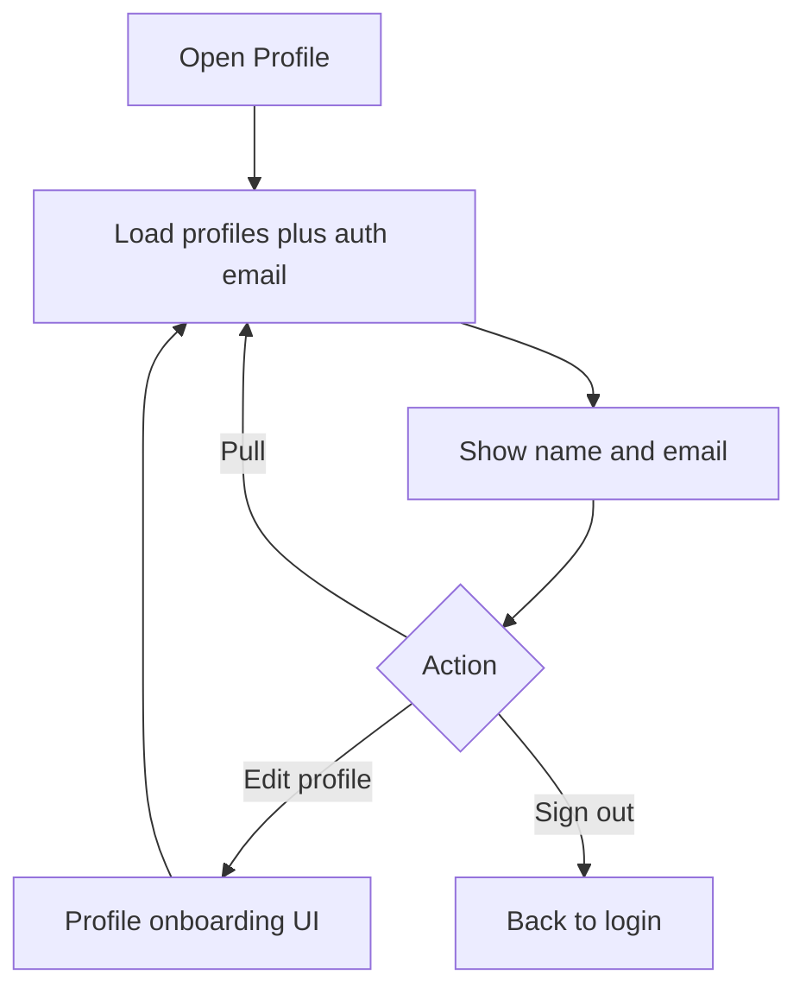

# Page: Profile

## Status
- [ ] Planned
- [x] In progress (real name + email; farm/device settings later)
- [ ] Done

## Purpose / goal
Account hub: see the farmer’s name and email, edit profile details, later farm/device settings, sign out.

## User flow
- Open Profile tab from the app shell.
- Read name (from `profiles`) and email (from Auth).
- Edit profile → `ProfileOnboardingPage(fromProfile: true)`; on return, reload name.
- Sign out → Supabase `signOut`.
- **Pull-to-refresh** to reload the saved profile.

## Data & sources
- **Name / address:** `profiles` via `OnboardingRepository.loadProfile()`.
- **Email:** `supabase.auth.currentUser?.email` (no silent `farmer@example.com` fallback — show a visible missing-email message if null).
- Farm & device row remains “coming next” (settings, not leftover mock sensor data).

## UI states
| State | What the user sees |
|---|---|
| Skeleton | First open only — account card placeholder |
| Cached | Last-known name during pull |
| Live | After fetch |
| Refreshing | Page-level `RefreshIndicator` |
| Error | Visible failure loading profile |

## Optimistic UI
None (read-only hub; edit is a pushed form).

## Functions
| Function | What it does | When called |
|---|---|---|
| `_loadProfile()` | Load `profiles` row | `initState`, pull, return from edit |

## Page logic flowchart

## Related
- Edit form: [onboarding.md](onboarding.md).
- Shell: Home / Analytics / Crops / Profile.
