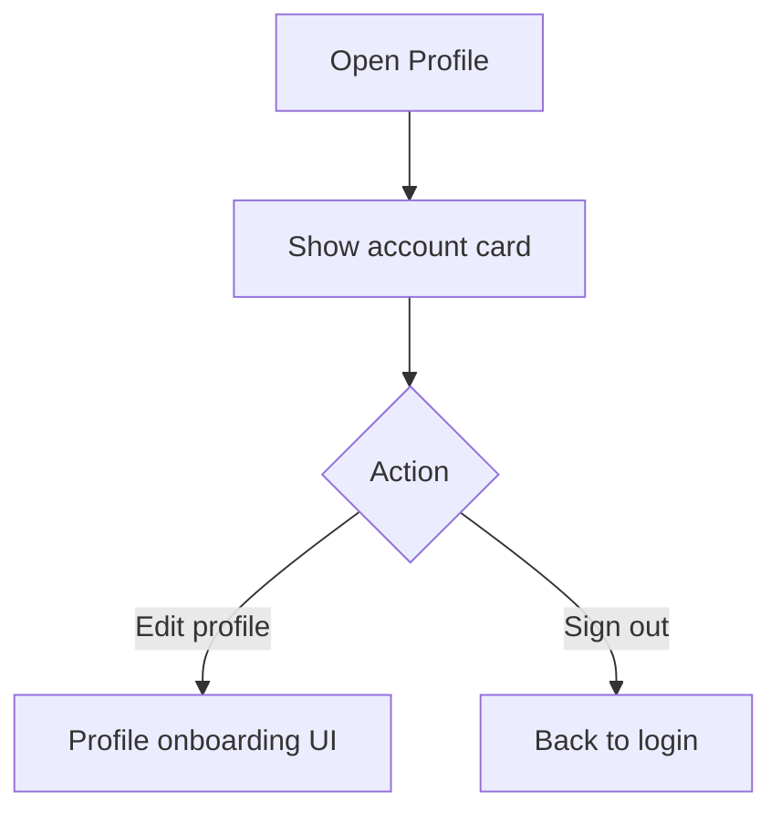

# Page: Profile

## Status
- [x] In progress (UI / navigation only)

## Purpose / goal
Account hub: see email, open profile edit, later farm/device settings, sign out.

## Navigation
- Edit profile → `ProfileOnboardingPage(fromProfile: true)`
- Sign out → Supabase `signOut` (real)

## Flowchart

